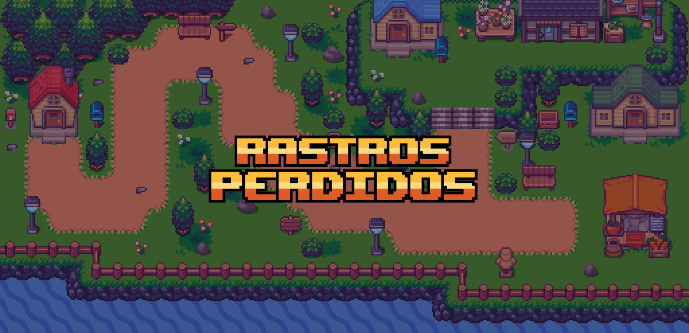
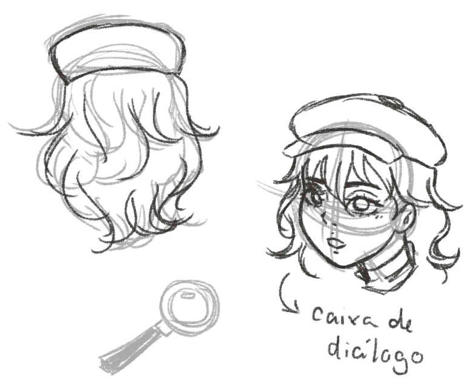
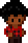

<b><h2>Universidade Federal Fluminense</h2></b>

 

Laboratório de Programação de Jogos
  

<b>Participantes do projeto:</b>
   

João Gabriel Lima Marinho e <a href="https://github.com/lynakashima">Yumi Nakashima</a>

## 1. Nome do projeto

Rastros Perdidos

## 2. Highconcept

O projeto Rastros Perdidos é um jogo de investigação em estilo RPG de 16 bits com jogabilidade de 8 direções, no qual o jogador assume o papel de uma detetive que está investigando um assassinato em uma vila. Nosso jogo apresenta enigmas e pistas em cada fase, sendo que cada casa representa uma parte da história principal do jogo. O aspecto diferencial e inovador do projeto está na sua estrutura de jogo, que combina elementos de jogos de investigação e RPG.

## 3. Gameplay e Enredo

**Fluxo de jogo:** \
Rastros Perdidos é um jogo de aventura e mistério, com elementos de quebra-cabeça, em que o jogador assume o papel da detetive Sofia, que está investigando o assassinato de uma pessoa em uma vila afastada da cidade. O jogo se passa em 3ª pessoa onde cada casa na vila representa uma fase composta por enigmas e pistas que ajudam a desvendar o culpado. O jogo termina a história com o culpado preso.

**Fases:**  
Cada casa da vila representa uma fase do jogo. Cada fase é composta por enigmas e puzzles que o jogador precisa resolver para avançar na história.

| Casa 1                                                  | Casa 2                                                                                     | Casa 3                                        |
| ------------------------------------------------------- | ------------------------------------------------------------------------------------------ | --------------------------------------------- |
| Desafio: Achar todos os papéis antes que o tempo acabe. | Desafio: Apertar todos os botões para acender a luz, desviando dos cacos de vidro no chão. | Desafio: Fugir dos fantasmas e achar a pista. |
| Pista: Cor do cabelo                                    | Pista: Cor da camisa                                                                       | Pista: Cor dos olhos                          |

**Personagens:** \
Sofia Moretti - A protagonista do jogo. É uma detetive determinada e astuta que está em busca de pistas para encontrar a pessoa desaparecida. Já foi uma moradora da vila onde acontece a história. Ela é uma mulher jovem, com cerca de 25 anos, com cabelos castanhos ondulados e olhos verdes. Ela veste um sobretudo bege e um chapéu de detetive clássico.

    
    &nbsp;
    

Rascunhos e desenhos da protagonista

&nbsp;

&nbsp;

Sprites de Sofia.

**Habitantes da Vila:** \
Os habitantes da vila são personagens secundários que podem ser encontrados nas ruas. A interação com eles se dá após completar as três fases, para decidir quem é o culpado.

**Enredo:** \
A história é a investigação de um desaparecimento na pacata Vila Jade. Sofia, uma detetive em ascensão e antiga moradora da vila foi chamada para desvendar o caso. Investigando as casas, é possível que o jogador junte três evidências para revelar o culpado.

**Cenário:** \
O cenário do jogo é a vila onde ocorreu o assassinato. Cada casa tem características únicas, com decorações e móveis diferentes. É uma vila pacata, afastada da grande cidade, rodeada por florestas densas. As casas possuem uma arquitetura semelhante porque foram construídas pela mesma pessoa. As ruas são limpas e bem cuidadas pelos moradores, que têm muito zelo pela vila.
